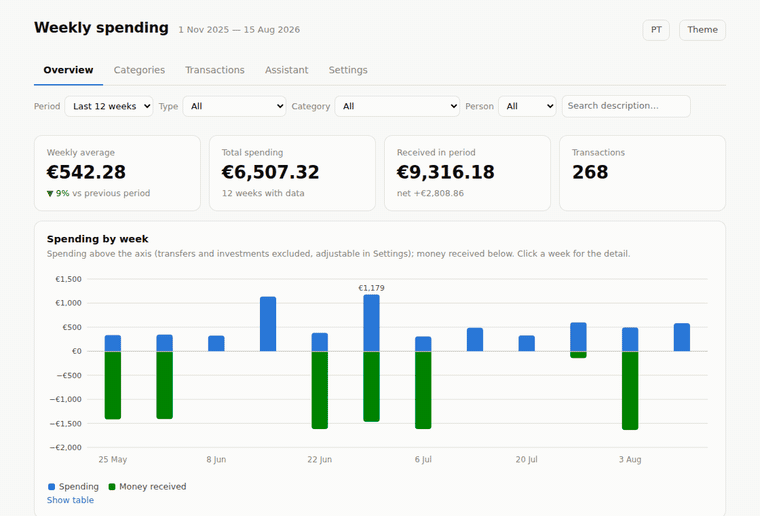

# Gastos semanais: despesas partilhadas para casais

Uma app numa única página que transforma extratos bancários numa imagem clara de
onde vai o dinheiro de um casal. Cada despesa pode ser marcada como **minha**,
**do meu namorado** ou **partilhada**, para a divisão ficar visível em vez de
adivinhada.

Corre tudo no browser. Os extratos são lidos no teu dispositivo, nada é enviado
para lado nenhum, e não há servidor, conta nem seguimento.



*A demonstração acima corre sobre dados inventados de um casal fictício.*

Ver o [README em inglês](README.md) para a descrição completa.

## Arrancar

```bash
python3 build.py              # constrói dist/index.html com os dados de demonstração
python3 build.py --empty      # versão vazia, para importares os teus extratos
```

Não há nada para instalar. O `build.py` junta os ficheiros de `src/` num único
HTML; a app é JavaScript simples, sem dependências.

## Os teus dados

O repositório inclui **apenas dados inventados**. Nenhum extrato real está aqui,
e o `.gitignore` está preparado para os manter de fora.

O que importares fica no armazenamento local do browser, no dispositivo onde o
fizeste. As Definições têm um botão de exportar, que é a forma de levares as tuas
categorias, regras e atribuições para outro dispositivo ou de guardares uma cópia.

## Licença

MIT. Ver [LICENSE](LICENSE).
